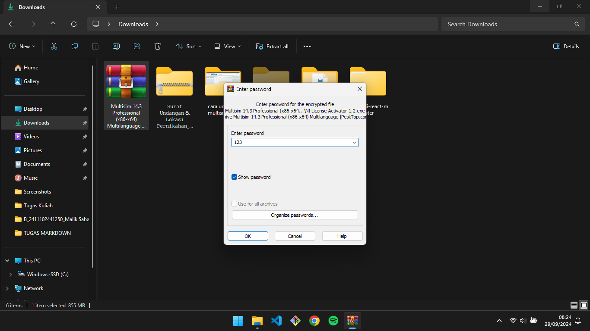
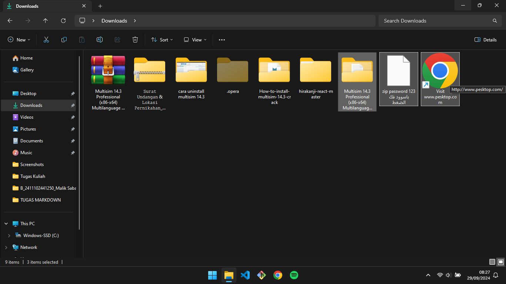
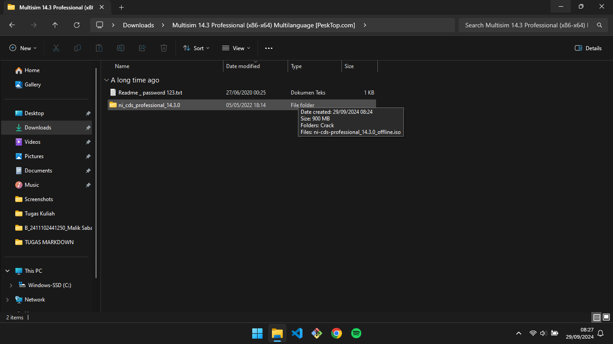
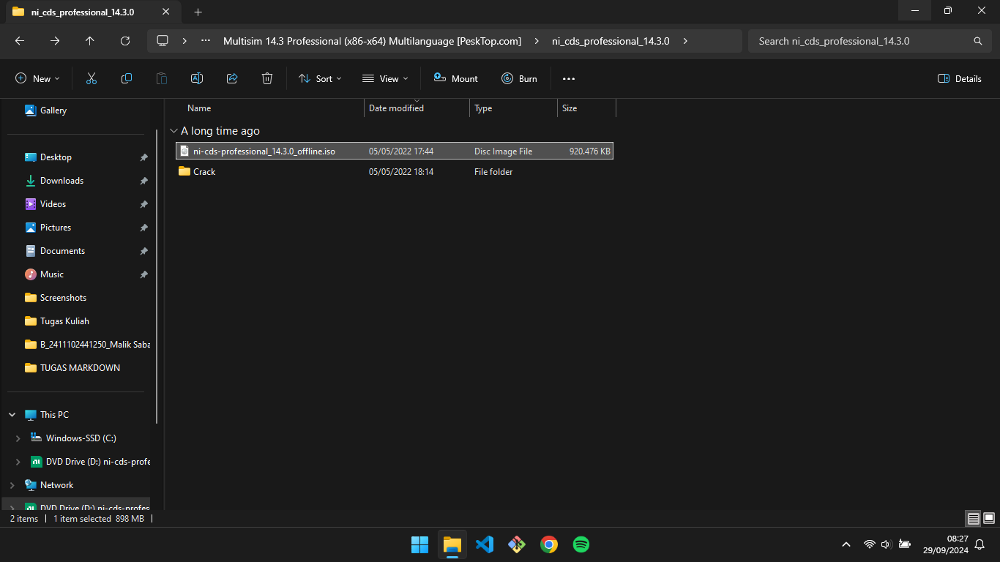

# **Cara download dan install Multisim 14.3 Crack**

 

## **Klik link di samping [https://pesktop.com/en/windows/multisim](https://pesktop.com/en/windows/multisim) untuk mendownload Multisim 14.3 Crack**

 

 

## **Klik Direct Download,dan tunggu sampai downloadnya selesai**

 

 

 

## **jika sudah selesai klik kanan pada file,dan extract Here**

 

 

## **Masukkan Password dan klik OK**

 

 

## **Jika sudah buka folder Multisim 14.3 professional**

 

 

## **buka folder ni_cds...**

 

 

## **buka file ni-cds-professional**

 

 

## **double klik install.exe**

 

 

## **pilih I accept..dan Next**

 

 

## **klik Next**

 

 

## **Tunggu installnya hingga selesai**

 

 

## **Klik yes,dan close installasinya**

 

 

## **buka folder crack di bagian ni*cds*..**

 

 

## **buka NI License,dan aktifkan semua opsinya**

 

 

## **seperti ini,jika sudah keluar dari NI License**

 

 

## **cari Multisim di windows,dan klik open file location**

 

 

## **Klik kanan pada NI multisim,dan klik show more options**

 

 

## **pilih Send to > Desktop**

 

 

## **Buka aplikasi multisim**

 

 

## **dan anda sudah bisa menggunakannya tanpa harus membelinya :D**

# **Terima Kasih :D**
